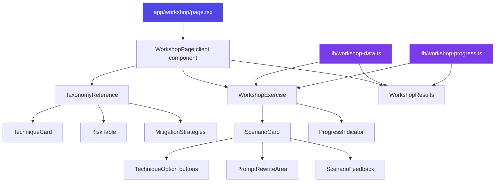

# Design Document: Prompt Engineering Workshop

## Overview

A single `/workshop` page that combines the full prompt engineering taxonomy reference with interactive exercises. The page has two main sections: a browsable reference of all 15 techniques (with risk profiles, examples, and mitigations), and a scenario-based exercise section where users practice identifying techniques. All state is client-side with optional localStorage persistence.

The page is a `'use client'` TSX route using existing Shadcn UI primitives (Card, Badge, Button, Tabs, Accordion, Textarea) and Tailwind CSS 4. It follows the flat component structure convention — workshop-specific components live directly in `components/`.

## Architecture



The page uses a tab-based layout (Shadcn Tabs) to switch between the "Reference" and "Practice" sections. The results summary replaces the practice view when all scenarios are complete.

## Components and Interfaces

### Page Entry Point

`app/workshop/page.tsx` — Server component that renders metadata and the client-side `WorkshopPage` component.

`app/workshop/layout.tsx` — Layout with gradient background matching existing static pages.

### Client Components (in `components/`)

| Component | File | Purpose |
|-----------|------|---------|
| `WorkshopPage` | `workshop-page.tsx` | Root client component. Manages tab state, loads progress from localStorage, orchestrates reference and exercise sections. |
| `TaxonomyReference` | `taxonomy-reference.tsx` | Renders all 15 technique cards, risk table, mitigation strategies, and cross-provider consensus. Uses Accordion for collapsible technique details. |
| `TechniqueCard` | `technique-card.tsx` | Displays a single technique: name, description, example prompt, risk badge, mitigated example. Uses Card + Badge. |
| `RiskTable` | `risk-table.tsx` | Renders the hallucination risk summary table with color-coded risk badges. |
| `WorkshopExercise` | `workshop-exercise.tsx` | Manages exercise flow: current scenario index, answer state, navigation between scenarios. Receives progress callbacks. |
| `ScenarioCard` | `scenario-card.tsx` | Renders a single scenario: description, technique option buttons, feedback area, optional prompt rewrite. |
| `PromptRewriteArea` | `prompt-rewrite-area.tsx` | Textarea for user's improved prompt + reveal button for sample answer. Uses Textarea from Shadcn. |
| `WorkshopResults` | `workshop-results.tsx` | Results summary: total score, per-technique breakdown, links to missed technique cards, restart button. |
| `ProgressIndicator` | `progress-indicator.tsx` | Shows completed/total count with a visual progress bar. |

### Data and Logic (in `lib/`)

| Module | File | Purpose |
|--------|------|---------|
| Workshop Data | `workshop-data.ts` | Static TypeScript file exporting technique definitions and scenario exercises. Single source of truth for all taxonomy content and exercise data. |
| Workshop Progress | `workshop-progress.ts` | Functions for reading/writing Progress_State to localStorage with fallback to in-memory state. Pure functions, no React dependencies. |

### Type Definitions

```typescript
// In lib/workshop-data.ts

interface Technique {
  id: string                    // e.g., "zero-shot", "chain-of-thought"
  name: string                  // e.g., "Zero-Shot", "Chain-of-Thought"
  description: string           // Technique description
  example: string               // Example prompt
  mitigatedExample: string      // Example with mitigations applied
  riskLevel: 'Low' | 'Low-Medium' | 'Medium' | 'Medium-High' | 'High'
  primaryVulnerability: string  // e.g., "No anchoring examples"
}

interface Scenario {
  id: string                    // Unique scenario identifier
  description: string           // The scenario/situation text
  correctTechniqueId: string    // References Technique.id
  distractorTechniqueIds: string[] // At least 3 distractor Technique.ids
  feedback: string              // Explanation shown on correct answer
  incorrectHints: Record<string, string> // techniqueId -> hint for why it's wrong
  promptRewrite?: {             // Optional sub-exercise
    originalPrompt: string      // The prompt to improve
    sampleImprovedPrompt: string // Reference improved version
  }
}
```

### Progress State Types

```typescript
// In lib/workshop-progress.ts

interface ScenarioResult {
  scenarioId: string
  correctOnFirstAttempt: boolean
}

interface ProgressState {
  completedScenarios: ScenarioResult[]
  currentScenarioIndex: number
}

function loadProgress(): ProgressState
function saveProgress(state: ProgressState): void
function resetProgress(): void
function isLocalStorageAvailable(): boolean
```

## Data Models

### Technique Data

All 15 techniques are defined as a static array in `lib/workshop-data.ts`, sourced from `docs/prompt-engineering-taxonomy-compact.md`. Each technique maps directly to a section in the taxonomy document.

```typescript
const TECHNIQUES: Technique[] = [
  {
    id: 'zero-shot',
    name: 'Zero-Shot',
    description: 'No examples provided — the model infers everything from the instruction alone...',
    example: 'Write me a git commit message for the staged changes.',
    mitigatedExample: 'Write a git commit message for the staged changes. Use the Conventional Commits format...',
    riskLevel: 'High',
    primaryVulnerability: 'No anchoring examples',
  },
  // ... 14 more techniques
]
```

### Scenario Data

Minimum 10 scenarios defined as a static array. Each scenario presents a realistic development situation and asks the user to identify the technique being used or the technique that should be applied.

### Progress State

Stored in localStorage under key `promptz-workshop-progress` as JSON. The `loadProgress` function parses stored JSON and validates its shape, returning a default empty state if parsing fails or localStorage is unavailable.

### Mitigation Strategies Data

The 7 universal mitigation strategies and 5 cross-provider consensus principles are defined as static arrays in `lib/workshop-data.ts`.

```typescript
interface MitigationStrategy {
  title: string
  description: string
  example: string
}

const MITIGATION_STRATEGIES: MitigationStrategy[] = [...]
const CROSS_PROVIDER_CONSENSUS: string[] = [...]
```


## Correctness Properties

*A property is a characteristic or behavior that should hold true across all valid executions of a system — essentially, a formal statement about what the system should do. Properties serve as the bridge between human-readable specifications and machine-verifiable correctness guarantees.*

### Property 1: Technique card renders all required fields

*For any* valid Technique object, rendering a TechniqueCard with that Technique SHALL produce output containing the technique name, description, example prompt, hallucination risk rating, and mitigated example prompt.

**Validates: Requirements 1.2**

### Property 2: Exercise data structural integrity

*For any* Scenario in the Exercise_Data array, the scenario SHALL have a non-empty description, a correctTechniqueId that references a valid Technique.id in the TECHNIQUES array, at least 3 entries in distractorTechniqueIds that each reference valid Technique.ids, a non-empty feedback string, and if a promptRewrite field is present it SHALL contain both a non-empty originalPrompt and a non-empty sampleImprovedPrompt.

**Validates: Requirements 2.2, 2.3, 2.4**

### Property 3: Correct answer feedback includes explanation and technique link

*For any* Scenario and when the user selects the correct Technique, the displayed feedback SHALL contain the scenario's feedback message and a navigable reference to the corresponding Technique_Card.

**Validates: Requirements 3.3**

### Property 4: Incorrect answer hint does not reveal correct answer

*For any* Scenario and any incorrect Technique selection, the displayed hint text SHALL NOT contain the name of the correct Technique.

**Validates: Requirements 3.4**

### Property 5: Progress state records completions accurately

*For any* sequence of Scenario completions (each with a scenarioId and a boolean correctOnFirstAttempt), the resulting Progress_State SHALL contain exactly one ScenarioResult per completed scenario with the correct scenarioId and correctOnFirstAttempt value.

**Validates: Requirements 4.1**

### Property 6: Progress indicator reflects completed count

*For any* Progress_State with N completed scenarios out of T total scenarios, the progress indicator SHALL display N and T accurately.

**Validates: Requirements 4.2**

### Property 7: Progress state localStorage round-trip

*For any* valid ProgressState object, saving it to localStorage via saveProgress and then loading it via loadProgress SHALL produce an equivalent ProgressState object.

**Validates: Requirements 4.3**

### Property 8: Results total score computation

*For any* set of ScenarioResult objects, the results summary total score SHALL equal the count of ScenarioResult entries where correctOnFirstAttempt is true, out of the total number of ScenarioResult entries.

**Validates: Requirements 5.1**

### Property 9: Results per-technique breakdown accuracy

*For any* set of ScenarioResult objects mapped to their corresponding Scenarios, the per-technique breakdown SHALL correctly partition techniques into "identified correctly" (correctOnFirstAttempt is true) and "missed" (correctOnFirstAttempt is false) sets, with no technique appearing in both sets.

**Validates: Requirements 5.2**

## Error Handling

| Scenario | Handling |
|----------|----------|
| localStorage unavailable (private browsing, quota exceeded) | `isLocalStorageAvailable()` returns false; progress functions fall back to in-memory state via React useState. No error shown to user. |
| Corrupted localStorage data | `loadProgress()` catches JSON parse errors and returns default empty ProgressState. Corrupted data is silently overwritten on next save. |
| Scenario references invalid technique ID | Validated at build/test time via Property 2. At runtime, missing technique lookups return a fallback "Unknown Technique" display. |
| User navigates away mid-scenario | Progress is saved after each scenario completion, not mid-scenario. Incomplete scenario state is lost, which is acceptable since the user can retry. |

## Testing Strategy

### Property-Based Testing

Use **fast-check** (already in the project) for property-based tests. Each property test runs a minimum of 100 iterations.

Property tests focus on:
- Data integrity of Exercise_Data (Property 2)
- Progress state serialization round-trip (Property 7)
- Score computation logic (Properties 8, 9)
- Hint safety — incorrect hints don't leak correct answers (Property 4)
- Progress tracking accuracy (Properties 5, 6)

Each test is tagged with: **Feature: prompt-engineering-taxonomy, Property {N}: {title}**

### Unit Testing

Use **Jest 30 + React Testing Library** (already in the project) for unit tests.

Unit tests focus on:
- TechniqueCard renders all fields for a specific technique (Property 1 as example)
- RiskTable renders all 15 rows (Requirement 1.3)
- MitigationStrategies renders all 7 strategies (Requirement 1.4)
- Exercise_Data has at least 10 scenarios (Requirement 2.1)
- Correct/incorrect answer UI feedback behavior (Properties 3, 4 as examples)
- Reset progress clears state (Requirement 4.4)
- localStorage fallback behavior (Requirement 4.5)
- Navigation includes /workshop link (Requirement 6.1)
- ARIA labels present on interactive elements (Requirement 7.3)

### Test File Structure

```
__tests__/unit/
├── lib/
│   ├── workshop-data.test.ts        # Data integrity properties + examples
│   └── workshop-progress.test.ts    # Progress round-trip property + unit tests
└── components/
    ├── technique-card.test.tsx       # Rendering properties
    ├── scenario-card.test.tsx        # Interaction properties
    ├── workshop-exercise.test.tsx    # Exercise flow tests
    └── workshop-results.test.tsx     # Score computation properties
```
